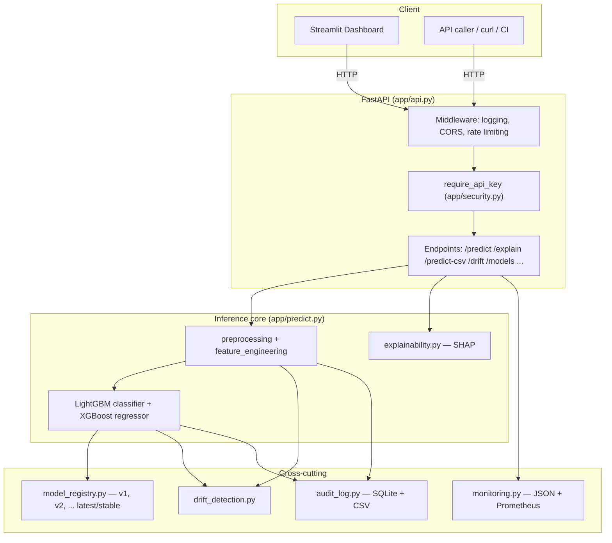
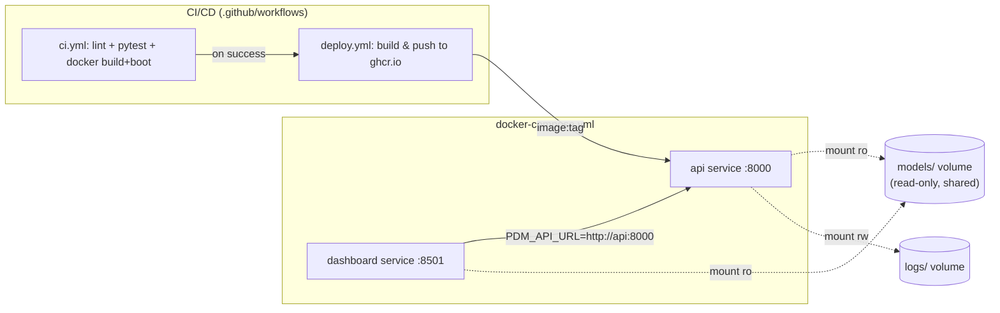
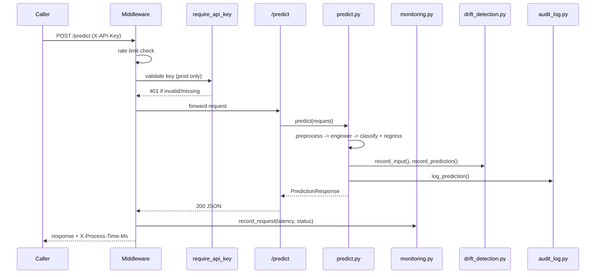
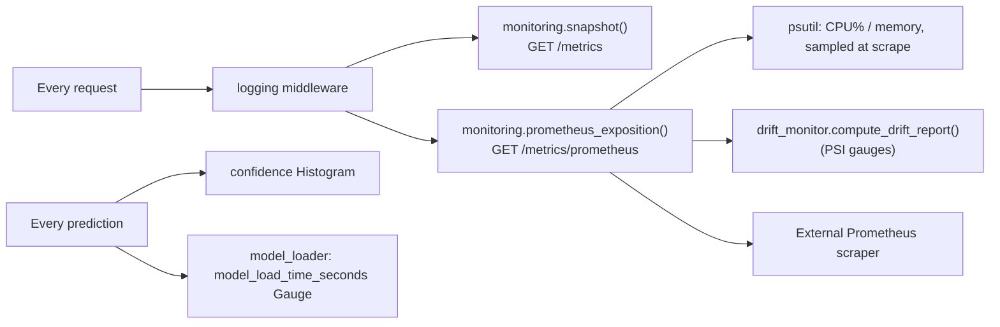
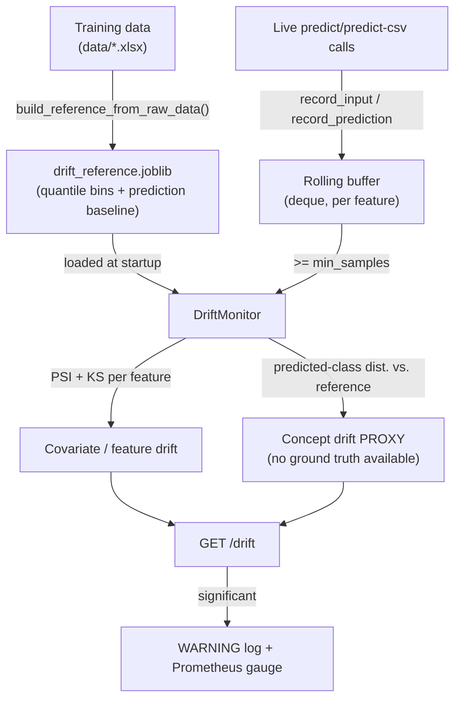
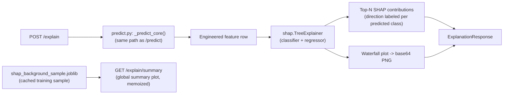

# Predictive Maintenance (PdM) — Industrial Centrifugal Pumps

End-to-end ML system: EDA → feature engineering → model training/comparison →
persistence → **FastAPI backend + Streamlit dashboard, Dockerized and ready
to deploy**. Predicts (1) failure severity classification and (2) remaining
useful life (RUL) regression from pump telemetry.

```json
{
  "failure_state": "Warning",
  "confidence": 0.9998,
  "remaining_useful_life": 120.4,
  "fault_diagnosis": null
}
```

`fault_diagnosis` is only populated when `failure_state == "Critical"` — see
[§17](#17-architecture-redesign-health-staging--fault-diagnosis).

**Code style note:** every `.py` file in this project is deliberately
comment- and docstring-free — zero `#` lines, zero `"""..."""` blocks,
verified by walking every file's AST/token stream. Behavior is documented
here in the README instead; function/variable/class names carry the meaning
in the code itself. The training notebook keeps a single one-line markdown
cell immediately before each code cell (no explanatory text after a cell,
no multi-paragraph write-ups) for the same reason — this README is the
single source of explanation for both.

---

## 1. Project Overview

Unplanned failures of industrial centrifugal pumps cause costly downtime.
This project turns hourly pump telemetry (vibration, temperature, pressure,
flow rate) into three decision-support signals for plant operators:

1. **Health-stage classification** — Normal / Warning / Critical (3-class).
2. **Fault diagnosis** — for Critical readings only, a separate rule-based
   module estimates which historical failure mode (Bearing / Motor / Seal,
   or "Unknown") the sensor pattern most resembles. See
   [§17](#17-architecture-redesign-health-staging--fault-diagnosis) for why
   this is a second module instead of more classifier classes.
3. **Remaining Useful Life (RUL) regression** — hours until failure, with a
   business-rule consistency check so it can never contradict the health
   stage or fault diagnosis (e.g. "Critical, diagnosed as a Bearing
   failure" always reports 0h remaining, never a stray positive number).

The project has two halves, built in two passes:

- **ML pipeline** (`Predictive_Maintenance_Pipeline.ipynb` + `pdm_utils.py`):
  dataset understanding, EDA, preprocessing, feature engineering, feature
  selection, training 4 classifiers × 4 regressors, evaluation, comparison,
  and persistence. Fully documented inline in the notebook.
- **Serving layer** (`app/`, `dashboard/`, `model_persistence.py`, `Dockerfile`):
  loads the already-trained models (**no retraining**) and exposes them via
  a FastAPI backend and a Streamlit dashboard, containerized for deployment.

---

## 2. Folder Structure

```
AI_Predictive/
│
├── app/                          # FastAPI backend + inference pipeline
│   ├── api.py                    # FastAPI app: routes, middleware, auth, rate limiting, error handling
│   ├── predict.py                # load_artifacts / preprocess_input / engineer_features /
│   │                              #   predict_failure / predict_rul / diagnose_critical_rows /
│   │                              #   apply_rul_consistency_rule / predict / explain / predict_batch
│   ├── fault_diagnosis.py        # rule-based Bearing/Motor/Seal/Unknown diagnosis for Critical predictions only
│   ├── preprocessing.py          # raw input -> pdm_utils-shaped DataFrame, imputation, safe encoding
│   ├── feature_engineering.py    # applies pdm_utils feature engineering via the saved config
│   ├── model_loader.py           # loads + caches artifacts, drift monitor, explainers, audit logger (per process)
│   ├── drift_detection.py        # PSI/KS covariate drift + prediction-distribution concept-drift proxy
│   ├── explainability.py         # SHAP TreeExplainer: top features, waterfall plots, summary plots
│   ├── monitoring.py             # simple JSON snapshot (GET /metrics) + Prometheus export (GET /metrics/prometheus)
│   ├── audit_log.py              # AuditLogger: every prediction -> SQLite + CSV
│   ├── security.py               # API key dependency + slowapi rate limiter
│   ├── schemas.py                # Pydantic request/response models
│   ├── utils.py                  # logging setup, timing helper, custom exceptions
│   └── config.py                 # env-aware settings: dev/testing/production, security, paths
│
├── dashboard/
│   └── streamlit_app.py          # 7-page dashboard (calls the API for predictions + explanations)
│
├── models/                       # versioned joblib artifacts -- NOT retrained by the app
│   ├── registry.json             # which version is `latest` vs. `stable` (served), full metadata history
│   ├── v1/                       # original 6-class model (Normal..Seal_Failure) -- kept for rollback only, not served
│   └── v2/                       # current `stable`: 3-class health classifier + fault_diagnosis_baseline
│       ├── classification_model_*.joblib
│       ├── regression_model_xgboost.joblib
│       ├── feature_scaler.joblib
│       ├── label_encoders.joblib
│       ├── selected_features.joblib
│       ├── class_names.joblib            # ["Normal", "Warning", "Critical"] as of v2
│       ├── feature_engineering_config.joblib
│       ├── fault_diagnosis_baseline.json # Normal-state mean/std per raw channel, for app/fault_diagnosis.py's z-scores
│       ├── drift_reference.joblib        # training-distribution baseline for /drift
│       ├── shap_background_sample.joblib # cached sample for SHAP summary plots
│       └── metadata.json                 # model_version, training_date, dataset_version, git_commit_hash, metrics
│
├── data/                         # raw training dataset (not needed at serving time)
├── outputs/figures/              # plots exported by the training notebook
├── logs/                         # api.log, predictions.log, errors.log, audit_log.db, audit_log.csv
├── tests/                        # pytest suite
├── .github/workflows/            # ci.yml (lint, test, docker build+verify), deploy.yml (publish to ghcr.io)
│
├── pdm_utils.py                  # training-pipeline functions (shared with app/ for identical preprocessing)
├── model_persistence.py          # save_models() / load_models() / predict() for ONE artifact directory
├── model_registry.py             # versioning on top of model_persistence: register / promote / rollback
├── Predictive_Maintenance_Pipeline.ipynb
│
├── Dockerfile                    # one image, two services (api + dashboard via different commands)
├── docker-compose.yml
├── requirements.txt
├── pytest.ini
├── ruff.toml
├── README.md
├── .env                          # local override layer (no secrets)
├── .env.development / .env.testing / .env.production   # per-environment defaults (no secrets)
└── .gitignore
```

---

## 3. Installation

```bash
git clone <this repo>
cd AI_Predictive
python3 -m venv .venv && source .venv/bin/activate
pip install -r requirements.txt
```

Run the two services locally (two terminals):

```bash
# Terminal 1 — API
uvicorn app.api:app --reload --host 0.0.0.0 --port 8000
# Swagger UI: http://localhost:8000/docs

# Terminal 2 — Dashboard
PDM_API_URL=http://localhost:8000 streamlit run dashboard/streamlit_app.py
# http://localhost:8501
```

Or run both with Docker — see [§10](#10-docker).

---

## 4. Dataset Description

10,000 hourly readings from 20 pumps (`AI_Predictive_Maintenance_Pump_Dataset_10000.xlsx`):

| Column | Description |
|---|---|
| `Timestamp`, `Asset_ID` | reading time; pump identifier |
| `Machine_Model`, `Location` | pump design; site (Location found to behave as noise, not used as a feature) |
| `Vibration_mm_s`, `Temperature_C`, `Pressure_psi`, `Flow_Rate_m3_h` | telemetry |
| `Failure_State` | Normal (9000) / Warning (800) / Critical (180) / Bearing_Failure (9) / Motor_Failure (7) / Seal_Failure (4) |
| `RUL_Hours` | hours remaining until failure (0 at a failure event) |

**Data-reality findings that shaped the pipeline** (from actually profiling
the file, not just its spec): 20 pumps are interleaved on one hourly log, so
each pump is sampled once every 20 hours; each pump runs repeated ~500-hour
degradation cycles; and raw sensor bands are non-overlapping for
Normal/Warning/Critical but overlap heavily across the three failure-type
classes, which total only 20 rows from a single pump. Full detail is in the
notebook's Stage 1–2.

---

## 5. ML Pipeline

All 9 stages run in `Predictive_Maintenance_Pipeline.ipynb`, executed
end-to-end with zero errors:

1. Dataset Understanding — feature purposes, business problem, ML approach.
2. EDA — distributions, class balance, correlation heatmap, outliers, insights after every plot.
3. Preprocessing — chronological per-asset sort, dedup, per-asset interpolation, label encoding, 3-class health-stage target construction + fault-diagnosis baseline stats (see [§17](#17-architecture-redesign-health-staging--fault-diagnosis)).
4. Feature Engineering — see [§6](#6-feature-engineering).
5. Feature Selection — correlation pruning (53→42) + RF importance + Mutual Information + RFE → 34 final features.
6. Data Preparation — **group-aware chronological 80:20 split** (not random — a random split would leak near-identical adjacent readings across train/test).
7. Model Training — Decision Tree, Random Forest, XGBoost, LightGBM for both tasks.
8. Model Comparison — ranked tables, per-class recall breakdown, deployment recommendation.
9. Model Persistence — save/load/round-trip-verify the selected models (this is what `models/` contains).

Run it: `jupyter nbconvert --to notebook --execute --inplace Predictive_Maintenance_Pipeline.ipynb`

---

## 6. Feature Engineering

Computed per-`Asset_ID` (never mixing one pump's history with another's):

- **Rolling mean/std** over the last 4 / 12 / 24 *readings* (reinterpreted from
  "hours" since each pump is only sampled every 20 hours — a calendar-hour
  window would be empty).
- **Lag features** `t-1, t-2, t-3`.
- **Rate of change & percent change** per telemetry channel.
- **Interaction terms**: Temperature×Pressure, Vibration×Temperature, Vibration×Pressure, Flow×Pressure.

At inference time, `app/feature_engineering.py` reproduces this **exactly**
by calling the same `pdm_utils` functions with the window/lag sizes read
from the persisted `feature_engineering_config.joblib` — not a
reimplementation, so "identical to training" is true by construction.

---

## 7. Models Used & Results

| Task | Algorithms compared | Selected | Why |
|---|---|---|---|
| Classification (`Failure_Class`, **3 health classes** as of `v2`) | Decision Tree, Random Forest, XGBoost, **LightGBM** | **LightGBM** (as of `v3`) | Best macro Recall (1.00, tied with all 4 models) — ties are now broken in favor of LightGBM specifically, since a single Decision Tree (the tie-break winner in `v2`) turned out to rely on only 2 of 33 features; see [§17](#17-architecture-redesign-health-staging--fault-diagnosis)'s "Model versioning: `v2` -> `v3`" subsection |
| Regression (`RUL_Hours`, unchanged) | Decision Tree, Random Forest, **XGBoost**, LightGBM | **XGBoost** | Best cross-validated MAE (37.0h) |

**Honest result, stated plainly:** all 4 classifiers hit macro Recall 1.00
on the 3-class health target — Normal/Warning/Critical occupy non-overlapping
sensor bands, and folding Bearing/Motor/Seal_Failure into Critical (see
[§17](#17-architecture-redesign-health-staging--fault-diagnosis)) removed
the only source of classifier ambiguity that existed in the old 6-class
target (those 3 classes' ~20 near-identical examples). This is a genuinely
easy 3-way separation, not an inflated metric — cross-validated F1 is
1.0000 ± 0.0000 for 3 of the 4 models. Component-level fault typing is where
the real difficulty was, and it's now handled by a separate, honestly-labeled
rule engine instead of inflating/deflating this classifier's metrics — see
[§17](#17-architecture-redesign-health-staging--fault-diagnosis).

Regression: MAE ≈ 37–40 hours, R² ≈ 0.87–0.88 across all 4 models
(unaffected by the classifier redesign — same target, same training rows).

### Investigated: does `Location` matter?

*(This experiment predates the `v2` health-staging redesign in [§17](#17-architecture-redesign-health-staging--fault-diagnosis)
and the Recall figures below refer to the original 6-class `v1` target —
re-run against the 3-class target if this becomes load-bearing again; the
qualitative conclusion, that `Location` isn't a stable per-asset attribute
and isn't selected by any feature-selection method, doesn't depend on the
classifier's class count.)*

A reasonable question to ask of this dataset — pump site/platform seems
like it should matter for failure risk. Checked before touching anything:

- `Location` isn't even a stable attribute of a given pump — the same
  `Asset_ID` is logged at a different site on almost every consecutive
  reading, which isn't physically possible for a real installed pump. Same
  problem as `Machine_Model` (see [§2](#2-folder-structure)/[§4](#4-dataset-description)).
- A chi-square test of `Location` against `Failure_State` gives p=0.29 (need
  <0.05 for significance) — no statistically meaningful relationship.

Retrained anyway to confirm empirically rather than rely on the statistics
alone: `Location` was label-encoded and added as a Stage 5 feature
*candidate*, available to correlation pruning, RF importance, mutual
information, and RFE. **It was not selected by any of them.** The resulting
model also scored *worse* on classifier macro Recall than the
`Machine_Model`-only version (0.667 vs. 0.80) — not because of `Location`
itself, but because adding it to the candidate pool shifted which *other*
features survived correlation pruning, and this dataset's three
failure-type classes are sensitive enough to feature-set changes (4–9 total
training examples, see above) that the shuffle landed worse. That
experimental version was discarded; `v1` (LightGBM, trained without
`Location` as a model input, superseded by the 3-class `v2` — see
[§17](#17-architecture-redesign-health-staging--fault-diagnosis)) is what
was registered from this experiment.

**`Location` is still wired in everywhere despite this**, as a required
field alongside `Machine_Model`: label-encoded in Stage 3, a required
dropdown in the dashboard (all 5 known sites), a required field on
`/predict` and `/predict-csv`, and tracked by drift monitoring. The
infrastructure doesn't hard-code which categoricals a model actually
*uses* — it reads whichever ones the active version's
`feature_engineering_config["categorical_cols"]` lists (currently just
`Machine_Model` for `v1`) — so `Location` is always collected and monitored
even though it isn't currently a model input. A future retrain with
`Location` data that's actually a stable per-asset attribute would pick it
up automatically with zero app code changes — that's exactly the scenario
`model_registry.py`'s `latest`-vs-`stable` split exists for: train, compare
honestly, promote only if it's actually better.

---

## 8. API Usage

Interactive docs at `/docs` (Swagger) once running. Endpoints marked 🔒
require an `X-API-Key` header when `PDM_API_KEY_REQUIRED=true` (on by
default in production, off in development/testing — see [§16](#16-mlops-architecture)).

| Method | Path | Purpose |
|---|---|---|
| GET | `/` | Liveness check |
| GET | `/health` | Readiness check + model identity |
| GET | `/metrics` | Request count, failure rate, latency percentiles, avg confidence, model load time (JSON) |
| GET | `/metrics/prometheus` | Same, in Prometheus text-exposition format, plus CPU/memory and drift PSI |
| GET | `/drift` | Data drift report (covariate PSI/KS per feature + prediction-drift proxy) |
| GET 🔒 | `/audit/recent` | Recent audit-logged predictions |
| GET 🔒 | `/audit/asset/{asset_id}` | Audit trail for one pump |
| GET 🔒 | `/models` | List registered model versions (`latest`/`stable`, metadata) |
| POST 🔒 | `/models/{version}/promote` | Promote a version to `stable` (serves it immediately) |
| POST 🔒 | `/models/rollback` | Revert `stable` to the previous version |
| POST 🔒 | `/predict` | Single pump reading (or history) → JSON prediction |
| POST 🔒 | `/explain` | Same as `/predict`, plus SHAP top features + waterfall plots |
| GET 🔒 | `/explain/summary` | Global SHAP summary plots over a cached training sample |
| POST 🔒 | `/predict-csv` | CSV upload → downloadable CSV of predictions |

`/predict`, `/explain`, and `/predict-csv` are also rate-limited
(`PDM_RATE_LIMIT_PREDICT`, default 20/minute in production) per client IP.

```bash
curl -X POST http://localhost:8000/predict \
  -H "Content-Type: application/json" -H "X-API-Key: $PDM_API_KEY" \
  -d '{"readings":[{"machine_model":"Nova-P","location":"Onshore-Terminal-1","vibration_mm_s":4.5,
       "temperature_c":80.0,"pressure_psi":135.0,"flow_rate_m3_h":235.0}]}'

curl -X POST http://localhost:8000/predict-csv \
  -H "X-API-Key: $PDM_API_KEY" -F "file=@pumps.csv" -o predictions.csv
```

A submitted `readings` list may be a single reading (rolling/lag features
then degrade gracefully to that one point) or a chronological history for
one pump (recommended: last ~24 readings) for materially better feature
quality. Unknown `machine_model` values, missing telemetry channels (with
history to interpolate from), and out-of-order/missing timestamps are all
handled — see `app/preprocessing.py` docstrings for exact behavior.

---

## 9. Streamlit Usage

```bash
PDM_API_URL=http://localhost:8000 streamlit run dashboard/streamlit_app.py
```

6 pages: **Home** (API status at a glance) · **Project Overview** ·
**Single Prediction** (manual form → live prediction + probability chart +
fault diagnosis when Critical) · **Batch Prediction** (CSV **or Excel**
upload → results table, charts incl. diagnosed-fault distribution, CSV +
Excel download) ·
**Prediction History** (session log + persisted `logs/predictions.log`) ·
**About**. (Feature Importance was removed — see [§9.1](#91-removed-feature-importance-page).)

The dashboard calls the FastAPI backend over HTTP for predictions (same
inference code path as `curl`/any other client) and reads `models/` /
`outputs/figures/` directly for read-only introspection pages.

### 9.1 Removed: Feature Importance page

The **Feature Importance** page (`page_feature_importance()` — Classifier /
Regressor gain-importance bar charts + a SHAP Summary tab) was removed at
the user's request. It's not needed to run or use the dashboard: `/explain`
and `/explain/summary` still exist on the API for anyone who wants
per-prediction or global SHAP explanations directly, and Single Prediction's
"Explain this prediction (SHAP)" checkbox still shows per-prediction
waterfall plots inline — only the standalone gain-importance/SHAP-summary
browsing page is gone.

### Prediction History: readable timestamps

Both the "This session" tab and the "Audit trail" tab were showing raw
`str(pandas.Timestamp)` values straight through — e.g.
`2026-07-15 09:00:11.075466+00:00`, full microsecond precision plus a raw
UTC offset, not something worth reading at a glance. Added
`format_timestamp()` (`dashboard/streamlit_app.py`) — parses via
`pandas.to_datetime`, drops sub-second precision, treats naive values as
UTC (the server's own convention — see `pd.Timestamp.utcnow()` elsewhere in
this file), converts to `Asia/Kolkata`, and renders as
`YYYY-MM-DD HH:MM:SS IST`. Applied at the point each session-history entry
is logged (`log_history_entry()` call sites) and to the `timestamp` column
of the audit-trail `DataFrame` before display/download. Verified: the exact
timestamp above now renders as `2026-07-15 14:30:11 IST`.

### Single Prediction: live preview + explicit "Predict" to save

The form previously used `st.form(...)` + a "Predict" submit button, which
batches all widget changes and only calls the API when the button is
clicked — change a value afterward and the old result just sits there until
you click "Predict" again. Removed the form entirely: every widget is now a
bare (non-form) input, so any change (dropdown, number field) triggers an
immediate script rerun, and the current widget values are compared against
`st.session_state["single_prediction_inputs"]` — only when they actually
differ does it call `/predict` (or `/explain`) again and refresh the
*preview* shown on the page, avoiding a redundant API call on every
unrelated rerun. The very first page load now shows a live preview
immediately from the default values, no interaction needed at all.

A separate **"Predict"** button sits below the live preview and does
exactly one thing: `log_history_entry()` the *currently shown* result into
the "This session" tab of Prediction History. This deliberately decouples
"see what this reading would score" (automatic, as you type) from "record
this one in history" (explicit click) — changing a value after clicking
resets `single_prediction_saved` to `False` (the "Saved to Prediction
History" confirmation disappears) so it's never ambiguous which result was
actually recorded. Verified: page load shows a Normal/466h preview with no
click; changing all four sensor values to a Bearing-failure combination
updates the preview to Critical/RUL=0 with no click, and the "Saved"
confirmation correctly disappears until "Predict" is clicked again — at
which point session history correctly shows two distinct entries (Normal,
then Critical), one per click, not one per keystroke.

### Single Prediction: no in-UI history editor, by design

The page's caption used to say *"Add optional history rows for more
reliable rolling/lag features,"* and briefly grew an editable
`st.data_editor` table to match it — `POST /predict` genuinely does support
a chronological list of readings per asset (used internally by
`feature_engineering.latest_reading_per_asset()`, and covered by
`test_predict.py::test_missing_channel_with_history_is_imputed_successfully`).
The data-editor table rendered incorrectly (an empty DataFrame with no rows
gives every column an unresolvable dtype, which `st.data_editor` fell back
to displaying as checkboxes) and was removed as visually distracting rather
than fixed — history-based prediction is still fully available via the API
(`POST /predict` with multiple `readings` for the same `asset_id`) or by
scripting `app.predict.predict()` directly; the caption was simplified back
to just describing the one-reading form that's actually there.

### Single Prediction: form bounds match the API's actual limits

The Single Prediction form's `number_input` widgets for Vibration/Temperature/
Pressure/Flow used their own hardcoded min/max (e.g. pressure allowed up to
300 in the form) that didn't match `pdm_utils.VALID_RANGES` (pressure's
actual limit: 160) enforced by `app/schemas.py` — so a value the form
happily accepted could still get rejected by the API with a raw Pydantic
`422` detail list, which is not something an end user should ever have to
read. Fixed by importing `pdm_utils.VALID_RANGES` directly into
`dashboard/streamlit_app.py` and setting each `number_input`'s `min_value`/
`max_value` from it (single source of truth, same pattern `app/schemas.py`
already uses) — the widget itself now prevents entering a value the API
would reject, and each field's label shows its valid range inline (e.g.
"Pressure (psi) [80-160]").

For any validation error that still reaches the UI (missing fields, wrong
types, a batch CSV with bad values), `format_api_error()` turns FastAPI's
raw `422` detail — a list of `{"loc": [...], "msg": ..., "input": ...}`
dicts — into a plain-language bullet list (e.g. "**pressure_psi**: Input
should be less than or equal to 160 (you entered `200.0`)") before it's
shown via `st.error(...)`. Plain-string errors (the app's own
`InputValidationError` messages) pass through unchanged. Used by
`call_predict()`, `call_explain()`, and `call_predict_csv()` — the API's
actual error response format is untouched, only how the dashboard displays
it changed.

### Batch Prediction: Excel upload

The file uploader accepts `.csv`, `.xlsx`, or `.xls`
(`dashboard/streamlit_app.py::read_uploaded_table()`). An uploaded Excel
file is parsed client-side (`pandas.read_excel`) and re-encoded to CSV bytes
before being sent to `POST /predict-csv` — the API's contract stays exactly
`.csv` in, unchanged; only the dashboard gained the convenience of accepting
either format, since users often already have the raw dataset as `.xlsx`.

### Batch Prediction: low-RUL highlighting

Batch results with `RUL_Hours_Predicted` under `LOW_RUL_THRESHOLD_HOURS`
(24h, `dashboard/streamlit_app.py`) are highlighted red — both in the
on-screen results table (`pandas.Styler`, `_low_rul_row_style()`) and in
the downloaded `.xlsx` (`build_predictions_excel()`, via `openpyxl`). This
always includes every `Critical` row (RUL is 0–10h by construction, see
[§17](#17-architecture-redesign-health-staging--fault-diagnosis)) plus any
`Warning` row whose RUL has dropped below 24h. Rows at or above the
threshold are left with no fill (plain) — deliberately not a second
"green = OK" color, to keep the highlighting to a single, unambiguous
"needs attention" signal rather than a two-color status scheme.

Two explicit, always-visible buttons handle downloads —
**"Download Predictions (.csv)"** and **"Download Predictions (.xlsx)"**
(`render_download_buttons()`) — instead of a single button paired with a
format-choice selector. The selector approach was replaced after real
testing showed it needed careful state handling to avoid feeling broken
(see the `st.session_state` fix below) and added a click of indirection for
no real benefit; two direct, unambiguous buttons are simpler and match
exactly what was asked for. CSV stays plain (the format has no concept of
cell colors); Excel keeps the red highlighting.

Both the on-screen table and the `.xlsx` download now include the
**original uploaded telemetry** (`Machine_Model`, `Location`,
`Vibration_mm_s`, `Temperature_C`, `Pressure_psi`, `Flow_Rate_m3_h`)
alongside every prediction column (`Failure_State_Predicted`, `Confidence`,
`RUL_Hours_Predicted`, `Diagnosed_Fault`) — previously `predict_batch()`'s
output only carried `Asset_ID`/`Timestamp`/prediction columns, dropping the
input data entirely. Fixed in `app/predict.py::predict_batch()` by adding
the raw columns (already present, unchanged, on `engineered_df` — zero new
computation) to the output `DataFrame` construction; this only widens the
returned columns and is fully backward compatible (existing consumers that
check for a column subset, like the test suite, are unaffected).

Two more real bugs surfaced and fixed while building this:

- **Timezone-aware `Timestamp` crashed the Excel export.** `pandas.to_excel`
  refuses `datetime64[ns, UTC]` columns outright
  (`ValueError: Excel does not support datetimes with timezones`).
  `build_predictions_excel()` now strips timezone info
  (`.dt.tz_localize(None)`) from any tz-aware datetime column before
  writing. This didn't surface through the normal dashboard→API→CSV path
  (CSV round-trips lose the dtype, so `Timestamp` arrives back as a plain
  string) but does if `build_predictions_excel()` is ever called on a
  DataFrame with a genuine tz-aware column — fixed defensively either way.
- **The Excel file was rebuilt from scratch on every rerun** (format
  changes, any other widget interaction) because `download_button`'s `data`
  argument is evaluated eagerly on every script run, not lazily on click —
  a real cost at "thousands of rows." Fixed by building
  `st.session_state["batch_result_xlsx"]` once, right after
  `st.session_state["batch_result_df"]`, inside the
  `if st.button("Run batch prediction"):` block, and reusing those bytes on
  every subsequent rerun instead of recomputing.

Because the results and downloads render outside the
`if st.button("Run batch prediction"):` block — `st.button()` is only
`True` for the one rerun immediately after the click — anything that
triggers its own rerun (a widget interaction elsewhere on the page) would
otherwise make the entire results section vanish. Stashing `result_df` (and
now the prebuilt `.xlsx` bytes) in `st.session_state` and rendering from
there on every rerun fixes this: it persists until the next "Run batch
prediction" click overwrites it.

One more bug this surfaced and fixed along the way: `POST /predict-csv`'s
response round-trips through actual CSV text, and pandas' `read_csv` parses
an empty `Diagnosed_Fault` field back as `NaN`, not `""`. Left unhandled,
`NaN != ""` is `True` in pandas, so the Critical-only "Fault diagnosis"
section was spuriously appearing even for an all-Normal batch with zero
Critical rows. `page_batch_prediction()` now normalizes with
`result_df["Diagnosed_Fault"].fillna("")` immediately after the API call,
before any diagnosis-dependent UI logic runs.

---

## 10. Docker

One `Dockerfile`, two `docker-compose.yml` services (`api`, `dashboard`)
built from the same image (`docker compose build` builds it once since both
services reference the same `image:` tag), sharing the `models/` folder as
a read-only volume:

```bash
docker build -t pdm-app:latest .
docker compose up -d          # starts both containers
docker compose logs -f api    # tail logs
docker compose down           # stop and remove containers
```

- API → `http://localhost:8000` (health-checked via `/health`)
- Dashboard → `http://localhost:8501` (health-checked via `/_stcore/health`,
  waits for the API's healthcheck via `depends_on: condition: service_healthy`)
- `libgomp1` is installed in the base image because LightGBM/XGBoost's
  OpenMP-based inference needs it at runtime, not just at training time.
- The image copies application code and already-trained model artifacts
  only — no raw dataset, notebook, or tests (see `.dockerignore`); models
  are **not** retrained in the image, they're the same joblib/JSON files
  `model_registry.py` already wrote to `models/v1/` and `models/v2/`.
  `COPY app/ ./app/` and `COPY models/ ./models/` are directory-level
  copies, so new files added to either (like `app/fault_diagnosis.py` or a
  future `models/v3/`) are picked up automatically with no Dockerfile edit.
- `.env` / `.env.<environment>` are deliberately **not** copied into the
  image — baking environment config (and in production's case, ever a real
  API key) into the image is the anti-pattern this avoids. `app/config.py`'s
  per-environment defaults already work with no `.env` file present, and
  real deployments should inject `PDM_*` env vars at runtime
  (`docker-compose.yml`'s `env_file:`, or the platform's own secret/env
  mechanism), never bundle them into the artifact.

**Verified in this environment:** `docker build` completed successfully;
`docker run` on the resulting image confirmed `app/fault_diagnosis.py`,
`model_registry.py`, and both `models/v1/` and `models/v2/` (including
`fault_diagnosis_baseline.json`) are present inside the container; the
booted API container's `/health` reported `model_loaded: true` against the
`v2` model, and a `POST /predict` against it returned a live
`fault_diagnosis` for a Critical reading — the same result as running
outside Docker, confirming nothing is missing from the image.

---

## 11. Deployment Guide

General prerequisites for any target below: `models/` must be present in
the deployed environment (either baked into the image at build time, as the
`Dockerfile` does, or mounted/uploaded separately) — the app never trains,
it only loads.

### CI/CD workflows

`.github/workflows/ci.yml` runs on every push/PR to `main`: `ruff check .`,
`python -m pytest -v`, then a Docker build-and-boot verification (starts
both the `api` and `dashboard` containers from the freshly built image and
polls their health endpoints, failing the job and dumping container logs if
either doesn't come up healthy within 30s). Nothing in CI retrains or
modifies any model; `models/` is checked into the repo and loaded as-is,
identical to how the running application loads it.

`.github/workflows/deploy.yml` runs after `CI` succeeds on `main`: it builds
the image and publishes it to GitHub Container Registry (`ghcr.io`) using
the repo's automatic `GITHUB_TOKEN` — no external secrets needed, so this
workflow is runnable as-is the moment it lands on a repo with Actions +
Packages enabled. That's the full extent of the "automatic deployment" this
workflow performs directly: publishing the deployable artifact. Actually
rolling that image out to a specific host (Render/Azure/EC2/Cloud Run) needs
that platform's own credentials, which this repo doesn't have configured.
Add a job like one of these once real deployment secrets exist as repo
secrets:

```yaml
  deploy-render:
    needs: publish
    runs-on: ubuntu-latest
    steps:
      - name: Trigger Render deploy hook
        run: curl -X POST "${{ secrets.RENDER_DEPLOY_HOOK_URL }}"

  deploy-cloud-run:
    needs: publish
    runs-on: ubuntu-latest
    steps:
      - uses: google-github-actions/auth@v2
        with:
          credentials_json: ${{ secrets.GCP_SA_KEY }}
      - uses: google-github-actions/setup-gcloud@v2
      - run: |
          gcloud run deploy pdm-api \
            --image ghcr.io/${{ github.repository }}:${{ github.sha }} \
            --region us-central1 --platform managed
```

### Render

1. Push this repo to GitHub.
2. New **Web Service** → connect the repo → Environment: **Docker**.
3. Two services (or one + a background worker) since Render's free tier
   runs one process per service:
   - `pdm-api`: Dockerfile build, expose port `8000`, health check path `/health`.
   - `pdm-dashboard`: same Dockerfile, override start command to the
     `streamlit run ...` command from `docker-compose.yml`, set env var
     `PDM_API_URL=https://pdm-api.onrender.com`.
4. Env vars: `PDM_LOG_LEVEL=INFO` (Render provides `PORT` automatically —
   update `CMD`/start command to bind `--port $PORT` instead of the fixed
   8000/8501 if using Render's dynamic port).
5. Render provisions HTTPS automatically on `*.onrender.com`.

### Azure App Service (Web App for Containers)

```bash
az group create -n pdm-rg -l eastus
az acr create -n pdmregistry -g pdm-rg --sku Basic
az acr build --registry pdmregistry --image pdm-app:latest .

az appservice plan create -n pdm-plan -g pdm-rg --is-linux --sku B1
az webapp create -n pdm-api -g pdm-rg --plan pdm-plan \
  --deployment-container-image-name pdmregistry.azurecr.io/pdm-app:latest
az webapp config appsettings set -n pdm-api -g pdm-rg \
  --settings PDM_HOST=0.0.0.0 WEBSITES_PORT=8000
az webapp config container set -n pdm-api -g pdm-rg \
  --container-command-line "uvicorn app.api:app --host 0.0.0.0 --port 8000"
# Repeat for pdm-dashboard with the streamlit command and WEBSITES_PORT=8501,
# PDM_API_URL=https://pdm-api.azurewebsites.net
```

App Service terminates TLS at the platform edge automatically
(`*.azurewebsites.net` is HTTPS by default; add a custom domain + managed
certificate for a branded URL). Scale via the App Service Plan tier /
autoscale rules on CPU%.

### AWS EC2

```bash
# On a fresh EC2 instance (Amazon Linux 2023 / Ubuntu), with Docker installed:
git clone <repo> && cd AI_Predictive
docker build -t pdm-app:latest .
docker compose up -d
```

- Open inbound Security Group rules for 8000/8501 (or better, only 80/443 —
  see HTTPS note below).
- **HTTPS**: EC2 has no built-in TLS termination. Put an
  **Application Load Balancer** (ACM-issued certificate) or an **nginx +
  certbot** reverse proxy in front of the two containers instead of exposing
  8000/8501 directly.
- **Scaling**: single EC2 instance is fine for light load; for real scale
  put the containers in an **ECS/Fargate service** behind the same ALB, with
  a target-tracking autoscaling policy on CPU or request count.

### Google Cloud Run

Cloud Run is a strong fit here — it's built for exactly this
"stateless container behind HTTPS, scales to zero" shape, and needs the API
and dashboard split into **two separate Cloud Run services** (Cloud Run runs
one process per container):

```bash
gcloud builds submit --tag gcr.io/PROJECT_ID/pdm-app

gcloud run deploy pdm-api \
  --image gcr.io/PROJECT_ID/pdm-app --port 8000 \
  --set-env-vars PDM_HOST=0.0.0.0 \
  --command uvicorn --args app.api:app,--host,0.0.0.0,--port,8000

gcloud run deploy pdm-dashboard \
  --image gcr.io/PROJECT_ID/pdm-app --port 8501 \
  --set-env-vars PDM_API_URL=https://pdm-api-xxxxx.a.run.app \
  --command streamlit --args run,dashboard/streamlit_app.py,--server.port,8501,--server.address,0.0.0.0,--server.headless,true
```

HTTPS is automatic on `*.run.app`. Scaling is automatic and to-zero by
default (set `--min-instances 1` on `pdm-api` if cold-start latency after
idle periods is a problem, since model loading takes ~150ms but the
container cold-start itself is slower).

### Production best practices (all targets)

- CORS, log level, API key requirement, and rate limits are already
  environment-aware (`.env.production` locks CORS to an explicit origin
  list and sets `PDM_LOG_LEVEL=WARNING` automatically — see [§16](#16-mlops-architecture)).
  Just set the real dashboard origin in `.env.production` (or the
  platform's env vars) before deploying; the defaults ship deliberately
  restrictive.
- Keep `logs/` on a persistent volume (already true in `docker-compose.yml`)
  or ship it to a log aggregator; `logs/audit_log.db` grows unbounded with
  traffic, so plan periodic archival for high-volume deployments.
- Run the API with multiple workers behind a process manager
  (`uvicorn ... --workers 4` or gunicorn+uvicorn workers) once traffic
  exceeds a single worker's capacity — model artifacts are loaded once per
  worker process (not shared across workers), so pick worker count based on
  available memory (~3MB per loaded model set is small, this is not a
  binding constraint here).
- Monitor `GET /metrics` (failure rate, p95 latency) with whatever
  monitoring stack the platform provides; alert on `failure_rate` climbing
  or `model_load_time_ms` being `null` (means artifacts never loaded).

---

## 12. Logging & Monitoring

Four persistent stores in `logs/`: `api.log` (all requests + info),
`errors.log` (warnings/errors only), `predictions.log` (one line per
prediction), and `audit_log.db` / `audit_log.csv` (the full structured
audit trail — see [§16.5](#165-audit-logging)). `GET /metrics` exposes a
simple JSON snapshot; `GET /metrics/prometheus` exposes the same data plus
CPU/memory and drift status in Prometheus text-exposition format — see
[§16.4](#164-production-monitoring).

---

## 13. Testing

```bash
python3 -m pytest -v
```

**58 tests across 7 files.** All run under `PDM_ENV=testing` (forced in
`tests/conftest.py`, so no API key is required and rate limits are generous
regardless of the machine's own environment — see `.env.testing`). These are
**integration tests against the real trained models in `models/v2/`** (the
current `stable` version), not mocks — the point is confirming the actual
persisted artifacts work, not a simulation of them. Where a test needs a
throwaway model (versioning, persistence round-trips), it fits one in
`tmp_path` in milliseconds rather than touching the real `models/` directory
— including `test_models_rollback_with_no_history_returns_409`, which used
to call `/models/rollback` against the *real* registry and would silently
roll production `stable` back to `v1` every time the suite ran once `v2`
existed; it now monkeypatches `config.MODELS_DIR` to an isolated `tmp_path`
registry with exactly one version, same as `test_model_registry.py` already
did at the `model_registry` level (found and fixed while retraining for
[§17](#17-architecture-redesign-health-staging--fault-diagnosis)).

A second real-audit-log bug was found the same way:
`test_audit_recent_returns_records_after_a_prediction`'s payload was missing
the required `location` field, so its `POST /predict` call had been
silently returning `422` this whole time — but the test never checked that
response's status code, and it kept "passing" only because *stale audit
records from earlier test runs* (the real, persistent `logs/audit_log.db`)
already satisfied `len(records) >= 1`. Wiping the audit log clean (see
[§16.5](#165-audit-logging)) exposed it immediately. Fixed by adding
`location` to the payload and asserting `predict_resp.status_code == 200`
before checking the audit trail, so a silently-failing POST can't be
masked by leftover state again.

| File | Tests | What it proves |
|---|---|---|
| `test_model_persistence.py` | 5 | `save_models()`/`load_models()` round-trip is lossless (a loaded model reproduces the exact same predictions as the one that was saved), including the `fault_diagnosis_baseline.json` artifact; missing directories/columns fail loudly instead of silently. |
| `test_model_registry.py` | 8 | A freshly registered version becomes `stable` automatically only if it's the *first* one; a second version is `latest` but does **not** take over serving until explicitly promoted; `promote_to_stable` / `rollback_to_previous` actually switch which version is active; rollback with no prior version, and promoting an unknown version, both fail loudly; every version's metadata carries training date, dataset version, and git commit hash. |
| `test_model_loader.py` | 4 | Artifacts load with the expected shape (right feature count, the 3 health-stage class names, a fault-diagnosis baseline with all 4 raw channels); the classifier/regressor are genuinely fitted (`.predict()` callable); `get_artifacts()` is cached (same object on a second call, not reloaded from disk) but `force_reload=True` genuinely reloads. |
| `test_fault_diagnosis.py` | 5 | The rule engine attributes a clearly-dominant channel correctly (vibration → Bearing, temperature → Motor, pressure+flow drop → Seal); a reading with no clearly-dominant channel reports `Unknown_Critical_Fault` instead of a false-confidence guess; confidence stays within `[0, 1]`. |
| `test_predict.py` | 14 | A Normal-range reading predicts Normal; a Warning-range reading predicts Warning/Critical; the 3 class probabilities always sum to 1; an unknown `machine_model` degrades to a warning instead of crashing; a missing telemetry channel is imputed successfully *if* history exists to interpolate from, and fails loudly if it doesn't; batch CSV prediction returns exactly one output row per input row, correctly grouping multi-row histories by `Asset_ID`; a Critical reading gets a non-null `fault_diagnosis` (and a Normal one doesn't), with RUL clamped into `[0, 10]`; `apply_rul_consistency_rule` zeroes RUL exactly when a *specific* fault (not `Unknown_Critical_Fault`) is diagnosed; batch prediction only populates `Diagnosed_Fault` for Critical rows. |
| `test_security.py` | 4 | The `X-API-Key` dependency is a no-op when `PDM_API_KEY_REQUIRED=False`; it accepts the correct key, rejects a missing key, and rejects a wrong key (each checked directly against `app.security.require_api_key`, monkeypatching `app.config` rather than needing a second live server). |
| `test_api.py` | 18 | Every endpoint end-to-end through a real `TestClient`: `/`, `/health`, `/metrics`, `/metrics/prometheus`, `/drift`, `/models`, `/models/{version}/promote`, `/models/rollback` (isolated registry, see above), `/audit/recent`, `/audit/asset/{id}`, `/predict` (success + 4 validation-failure shapes: empty readings, wrong type, missing required field, out-of-range value), `/explain` (SHAP explanation matches the prediction it explains — `predicted_class_label == prediction.failure_state`, the exact invariant a code-review pass caught and fixed, see [§16.8](#168-final-production-review)), `/predict-csv` (success, non-CSV rejected, missing column rejected). |

CI (`.github/workflows/ci.yml`) runs this exact suite, `ruff check .`, and a
Docker build-and-boot verification (both the API's `/health` and the
dashboard's `/_stcore/health`) on every push/PR to `main`.

**Manual/interactive verification done during development** (not automated,
but exercised directly while building each piece): every endpoint hit with
`curl`, all 8 Streamlit pages driven through Streamlit's own `AppTest`
framework (including submitting the Single Prediction form with the SHAP
explain checkbox checked and confirming the resulting tables/images render),
`docker compose config` validated, both workflow YAML files parsed and
checked, and the drift detector specifically validated against a true
held-out resample of the training data (PSI ≈ 0, confirming no false
positive) before being trusted.

---

## 16. MLOps Architecture

Everything in this section is additive on top of the serving layer in
§8–§11 — same models, same inference pipeline, wrapped with the operational
tooling a production deployment needs around it. Nothing here retrains or
modifies `models/v1/`.

### Production architecture



### Deployment architecture



### API request flow



### Monitoring flow



### Drift detection workflow



### Explainability workflow



### 16.1 Model versioning

`model_registry.py` sits on top of the already-tested `model_persistence.py`
(unchanged): each version is its own directory (`models/v1/`, `v2/`, ...)
with full metadata (`model_version`, `training_date`, `dataset_version`,
`git_commit_hash`, test metrics). A registered version is `latest`
immediately but only serves traffic once explicitly promoted to `stable` —
a deliberate human checkpoint between "trained successfully" and "serving
production traffic." `app.model_loader.get_artifacts()` always resolves
`stable` by default.

```python
import model_registry as mr
mr.list_versions("models")                    # every version + metadata
mr.promote_to_stable("models", "v2")           # go live
mr.rollback_to_previous("models")              # instantly revert
```
Or via the API: `GET /models`, `POST /models/{version}/promote`, `POST /models/rollback` (all require the API key).

### 16.2 Data drift detection

Reference distributions (Vibration, Temperature, Pressure, Flow, Machine_Model)
are built once from the training data and saved per model version. Live
traffic is compared against them via **Population Stability Index (PSI)** —
the standard industry metric — using **quantile-based reference bins**
(critical here: this dataset mixes far-apart Normal/Warning/Critical/Failure
sub-populations, so naive equal-width bins produce spurious high PSI even
for matching data; quantile bins fixed that, verified by resampling directly
from training data and confirming PSI ≈ 0). A Kolmogorov-Smirnov test backs
up each PSI score. **Concept drift** — a change in the true input→output
relationship — cannot be measured without ground-truth labels on live data,
which this system doesn't have; what's implemented is an explicitly-labeled
**proxy**: comparing the model's own output distribution (predicted class
frequencies, mean confidence, mean RUL) against its behavior on a training
sample. `GET /drift` returns per-feature PSI/KS, the categorical check, and
the prediction-drift proxy, each with a `none`/`moderate`/`significant`
verdict (thresholds: PSI ≥ 0.10 moderate, ≥ 0.25 significant).

### 16.3 Explainable AI

Both production models are tree ensembles, so `shap.TreeExplainer` computes
**exact** SHAP values via tree traversal — no approximation, fast enough
per-request. `POST /explain` returns the same prediction as `/predict` plus
the top-8 contributing features (direction labeled relative to the
*predicted* class — "pushes toward Warning," never a hardcoded "increases
risk," since that label's meaning flips depending on which class is
predicted) and a waterfall plot. `GET /explain/summary` returns a global
feature-impact plot over a cached training sample. **Worth knowing:**
XGBoost 3.x serializes `base_score` in a format SHAP 0.49.1 doesn't parse;
`app/explainability.py` documents and works around this with a narrow
monkeypatch verified to reproduce the model's exact predictions (SHAP values
+ base value == `model.predict()`, checked in code).

### 16.4 Production monitoring

`GET /metrics` (JSON) and `GET /metrics/prometheus` (Prometheus exposition)
are both written from the same `monitoring.record_*()` calls, so
instrumentation lives in one place. Tracked: request count, failure rate,
latency (histogram + percentiles), prediction count, average confidence,
model load time, process CPU/memory (sampled at scrape time via `psutil`),
and current data drift status/PSI per feature.

### 16.5 Audit logging

Every prediction — single or batch, one row each — is written to both
`logs/audit_log.db` (SQLite, queryable, backs the dashboard's Prediction
History page and `GET /audit/*`) and `logs/audit_log.csv` (append-only) via
one `AuditLogger.log_prediction()` call, so the two never drift apart.
Stored: timestamp, asset ID, input telemetry, predicted class/state,
confidence, RUL, **model version served**, and inference latency.

### 16.6 Configuration management

`PDM_ENV` (`development` default / `testing` / `production`) selects which
`.env.<environment>` file loads (committed, no secrets), with `.env` loaded
on top as a local override layer. Environment-aware defaults: log level
(`DEBUG`/`INFO`/`WARNING`), API key requirement (off/off/**on**), CORS
(permissive/permissive/**locked to an explicit list**), rate limits
(generous/generous/**strict**), and error verbosity (full detail in
dev/testing, generic messages in production — full detail always still
logged server-side). `python3 -m pytest` forces `PDM_ENV=testing` in
`conftest.py` so the suite behaves identically on every machine and in CI.

### 16.7 Security

- **API key**: `X-API-Key` header, checked with `hmac.compare_digest`
  (timing-safe) via a FastAPI dependency, enforced on every
  prediction/explain/audit/admin endpoint when `PDM_API_KEY_REQUIRED=true`.
  `/`, `/health`, `/metrics`, `/metrics/prometheus`, and `/drift` stay open
  (load balancers and monitoring scrapers need unauthenticated access).
- **Rate limiting**: `slowapi`, per-client-IP, configurable limits for
  prediction endpoints vs. everything else.
- **CORS**: explicit origin allowlist in production (`.env.production`),
  permissive only in development.
- **Input validation**: Pydantic field constraints (ranges, required
  fields) plus domain-level checks (unknown categories, unrecoverable
  missing values) — see [§8](#8-api-usage).
- **Secure error responses**: internal exception text is only echoed to
  callers in development/testing; production returns a generic message
  while logging full detail server-side (`app/api.py::_error_response`).

---

## 16.8 Final Production Review

A deliberate review pass over the MLOps additions in this section (§16),
looking for code smells, performance bottlenecks, security issues,
scalability concerns, and maintainability problems. One real bug was found
and fixed during this pass; the rest are documented limitations with a
specific recommended fix, not vague caveats.

**Fixed during review:**
- **Correctness smell in `app/explainability.py`**: `explain_prediction()`
  originally *re-derived* the predicted class from
  `argmax(SHAP values + base_value)` instead of reusing the class the
  classifier's own `.predict()` had already returned in `_predict_core()`.
  Mathematically these agree (softmax is monotonic, so argmax of raw
  margins == argmax of probabilities), but computing "what did the model
  predict" two different ways in the same response is a latent
  inconsistency risk for zero benefit. Fixed by passing `predicted_class`
  into `explain_prediction()` explicitly; `tests/test_api.py::test_explain_endpoint_returns_shap_explanation`
  now asserts `predicted_class_label == prediction.failure_state` to keep
  it that way.

**Known limitations, with recommended fixes (not fixed — disproportionate
to this project's current scale, but the right call once traffic grows):**
- **Concurrency in `app/model_loader.py`**: model artifacts, the drift
  monitor, explainers, and background sample are held in plain module-level
  globals, reassigned (not lock-protected) by `get_artifacts(force_reload=True)`
  — which `/models/{version}/promote` and `/models/rollback` call directly.
  A request reading `_artifacts` at the exact moment a promotion is
  reassigning it could theoretically observe a partially-updated state.
  **Fix**: build the new artifacts/monitor/explainers bundle fully before
  publishing it, then swap one reference atomically under a lock (or move
  to an immutable "current context" object replaced in one assignment)
  rather than mutating several globals in sequence.
- **`app/audit_log.py` opens a new SQLite connection per write.** Safe and
  simple, but each connection open/close has overhead that would show up
  under sustained high write throughput. **Fix**: a single long-lived
  connection guarded by the existing lock, or a small connection pool, once
  audit-log write volume actually justifies it.
- **Rate limiting keys on `get_remote_address`**, which sees a reverse
  proxy's IP, not the real client, when deployed behind one (ALB, nginx,
  Cloud Run's load balancer). **Fix**: configure `slowapi`'s
  `key_func` to read `X-Forwarded-For` once a specific reverse proxy is
  chosen, trusting only that proxy's header.
- **CORS allows all methods/headers** (`allow_methods=["*"]`,
  `allow_headers=["*"]`) even though origins are locked down in production.
  Broader than strictly needed for a JSON+multipart API. **Fix**: narrow to
  `["GET", "POST"]` / `["Content-Type", "X-API-Key"]` if tightening this
  further becomes a priority.
- **Docker build was manually verified once** (see [§10](#10-docker)) with
  a real Docker daemon: `docker build` succeeded, and a booted API container
  correctly served the `v2` model end-to-end. `.github/workflows/ci.yml`'s
  `docker-build-verify` job runs the same build-and-boot check on every
  push, so this stays continuously verified rather than a one-off.

**Not a finding, confirmed working as intended:** the perfect-looking
classification metrics (§7), the PSI drift metric's initial oversensitivity
(fixed earlier in development by switching to quantile bins — see
[§16.2](#162-data-drift-detection)), and the XGBoost/SHAP `base_score`
compatibility workaround (§16.3) were all investigated and are documented
where they live, not swept into this section.

---

## 17. Architecture Redesign: Health Staging + Fault Diagnosis

### The problem

The original classifier predicted 6 classes directly: Normal, Warning,
Critical, Bearing_Failure, Motor_Failure, Seal_Failure. The RUL regressor is
a completely independent model with no knowledge of what the classifier
predicted. Nothing enforced agreement between them, so a reading the
classifier called `Bearing_Failure` — a machine that has, by definition,
already failed — could still get a regressor output like "365.6 hours
remaining." That's not a rare edge case either: the three failure-type
classes had only ~20 total training examples, all from one pump, so the
classifier's confidence on exactly those classes was the least trustworthy
part of the whole system (see the original [§7](#7-models-used--results)
caveat, kept below for context).

### The redesign

1. **The classifier now only stages health**: `Normal` / `Warning` /
   `Critical` (3 classes, `pdm_utils.HEALTH_STATES`). Training rows
   originally labeled `Bearing_Failure` / `Motor_Failure` / `Seal_Failure`
   are folded into `Critical` for this target — from a health-monitoring
   standpoint, a failed bearing *is* a critical machine state; which
   component failed is a downstream diagnosis question, not a health stage.
2. **A separate rule-based module, `app/fault_diagnosis.py`, runs only when
   the classifier predicts `Critical`**, and reports one of
   `Bearing_Failure` / `Motor_Failure` / `Seal_Failure` /
   `Unknown_Critical_Fault`.
3. **RUL is business-rule-consistent with both outputs**, not just the
   classifier's, via an extended `apply_rul_consistency_rule()` in
   `app/predict.py`.

### Why a rule engine, not a second classifier

Before choosing an approach, the ~20 historical Bearing/Motor/Seal_Failure
rows were checked directly against a Normal-state baseline (mean/std per
raw channel) to see whether any channel's deviation cleanly separates the
three failure types:

```
Bearing_Failure  actual | top-signal=Bearing_Failure  score=19.61  runner-up=Seal_Failure  ratio=1.02
Bearing_Failure  actual | top-signal=Seal_Failure     score=19.29  runner-up=Bearing_Failure ratio=1.11
Motor_Failure    actual | top-signal=Bearing_Failure  score=18.97  runner-up=Seal_Failure    ratio=1.00
...
```

All four raw channels are pegged near their extreme simultaneously on every
one of these ~20 rows (a synthetic-data artifact — Vibration ~10-12.4,
Temperature ~105-120, Pressure ~90-108, Flow ~160-194 for *all three*
failure types, not just their "own" channel), so no channel reliably
dominates per failure type. Temperature (the "Motor" signal) never once
wins. **Fitting or validating a trained classifier on this signal would be
p-hacking a 20-row dataset, not machine learning** — any accuracy number it
reported would be noise dressed up as a metric, exactly the trap the
project's existing "honest caveat" culture (see original [§7](#7-models-used--results))
exists to avoid.

Instead, `app/fault_diagnosis.py` encodes the standard reliability-engineering
heuristic a vibration/reliability engineer would reach for first:

| Fault | Driving signal |
|---|---|
| Bearing_Failure | elevated **vibration** |
| Motor_Failure | elevated **temperature** |
| Seal_Failure | **pressure + flow rate drop** together (fluid escaping past the seal) |

For each Critical reading, it computes a `\|z-score\|` deviation from the
Normal-state baseline (`fault_diagnosis_baseline.json`, built once during
training from `pdm_utils.compute_fault_diagnosis_baseline()`) per channel,
and reports the corresponding fault **only if** its signal leads the
runner-up by `DOMINANCE_MARGIN = 1.15` (15%). Below that margin, it reports
`Unknown_Critical_Fault` rather than guess — on the historical 20-row
sample above, most rows fall under this margin and correctly report
`Unknown_Critical_Fault`, which is the honest answer for data this
underspecified. This is a deliberately conservative, fully auditable
scaffold, not a validated model — recalibrate `DOMINANCE_MARGIN` or replace
it with a trained classifier once real, physically-differentiated failure
data is collected across multiple assets (tracked in
[§19](#19-future-improvements)).

### RUL consistency, end to end

`app/predict.py::apply_rul_consistency_rule()` now does two things, in order,
for every prediction:

1. **Clamp into the predicted health stage's known-plausible band**
   (`CLASS_RUL_BOUNDS`, derived from training data: Normal `[51, 500]`,
   Warning `[11, 50]`, Critical `[0, 10]` — the Critical upper bound of `0`
   accounts for the former terminal-failure rows now folded into it). This
   catches the regressor extrapolating on an out-of-range or merely unusual
   input (e.g. predicting 367h for a reading the classifier calls
   `Warning`, whose training rows never exceed 50h — the original bug that
   motivated tightening `app/schemas.py`'s input bounds, see below).
2. **Force RUL to exactly `0` when `fault_diagnosis` names a *specific*
   fault** (`Bearing_Failure` / `Motor_Failure` / `Seal_Failure`, not
   `Unknown_Critical_Fault`) — a diagnosed fault means the machine has
   already failed, so "hours remaining" is meaningless. An
   `Unknown_Critical_Fault` reading keeps its clamped Critical-band RUL,
   since severity is still ambiguous but the machine hasn't been confirmed
   failed.

A closely related, separately-discovered issue was tightened at the same
time: `app/schemas.py` and `app/preprocessing.py` previously accepted sensor
values far outside anything in the training data (e.g. `pressure_psi` up to
1000 psi against a training range of 90.6-150 psi) — exactly the kind of
out-of-distribution input that causes the classifier and regressor to
disagree in the first place. Both now enforce `pdm_utils.VALID_RANGES`
(training-data range + small margin) at the input boundary, for both the
JSON (`/predict`) and CSV (`/predict-csv`) paths:

| Channel | Training data observed range | Enforced `VALID_RANGES` |
|---|---|---|
| `Vibration_mm_s` | 1.2 – 12.4 | 0 – 15 |
| `Temperature_C` | 55.0 – 119.3 | 40 – 130 |
| `Pressure_psi` | 90.6 – 150.0 | 80 – 160 |
| `Flow_Rate_m3_h` | 160.0 – 255.0 | 140 – 270 |

### Every file changed, and why

| File | Change | Why |
|---|---|---|
| `pdm_utils.py` | `HEALTH_STATES` (3-class) replaces `CLASS_NAMES`'s old 6-class list; `map_failure_state_classes()` now folds terminal states into `Critical` via `_HEALTH_STATE_MAP`; new `compute_fault_diagnosis_baseline()`. | Single source of truth for the classifier's new target and the diagnosis module's baseline stats, shared by the notebook and the app exactly like every other `pdm_utils` function already was. |
| `app/fault_diagnosis.py` | **New file.** `diagnose()` + `FaultDiagnosisResult`. | The separate, explainable diagnosis module the redesign calls for — kept out of `app/predict.py` so it can be tested, reasoned about, and eventually replaced independently. |
| `app/predict.py` | `diagnose_critical_rows()` (new); `apply_rul_consistency_rule()` extended with `diagnosed_faults` + a `CLASS_RUL_BOUNDS` that dropped the old terminal-state entries; both `_predict_core()` (single) and `predict_batch()` wire the diagnosis into the response/output. | This is where the classifier, regressor, and diagnosis module's outputs actually get reconciled into one consistent answer. |
| `app/schemas.py` | New `FaultDiagnosis` model; `PredictionResponse.fault_diagnosis` (optional, additive); `failure_class` doc updated to 0-2; sensor field bounds tightened to `pdm_utils.VALID_RANGES`. | Surface the diagnosis over the API without changing any existing field's meaning; close the out-of-distribution input gap described above. |
| `app/preprocessing.py` | `dataframe_from_csv_bytes()` now validates `pdm_utils.VALID_RANGES` per numeric column. | The CSV batch path bypasses Pydantic entirely, so it needed the same range check applied separately. |
| `model_persistence.py` | New `fault_diagnosis_baseline` field on `ModelArtifacts`; `save_models()`/`load_models()` read/write `fault_diagnosis_baseline.json`. | The baseline stats need to travel with the rest of a model version's artifacts, versioned and rolled-back together. |
| `model_registry.py` | `register_version()` / `migrate_flat_models_to_v1()` pass `fault_diagnosis_baseline` through to `model_persistence`. | Keeps the registry's artifact set complete without the caller needing to know persistence internals. |
| `Predictive_Maintenance_Pipeline.ipynb` | Stage 3 uses the new 3-class mapping + computes the fault-diagnosis baseline; Stage 5's `EXCLUDE_COLS` adds `Health_State`; Stage 7a's confusion-matrix figure is now 1×3 (was 2×2 for 6 classes); Stage 9 passes `fault_diagnosis_baseline` into `register_version()` and adds a cell to build+save `drift_reference.joblib` + `shap_background_sample.joblib` for the new version (previously built outside the notebook — now reproducible via `jupyter nbconvert --execute`, see [§5](#5-ml-pipeline)). | The notebook is the source of truth for how a version is trained; it needed to actually produce what `v2` requires, not just describe it. |
| `dashboard/streamlit_app.py` | Single Prediction shows a "Fault diagnosis" section (badge, rule-engine confidence, dominant channel, rationale, per-channel deviation table) when `fault_diagnosis` is non-null; Batch Prediction adds a diagnosed-fault distribution chart when any `Diagnosed_Fault` values are present; Overview/About copy updated to describe the two-module design instead of a 6-class classifier. | Same pages, same navigation (`PAGES` dict unchanged) — purely additive content within existing pages, not a redesign of the dashboard's architecture, per the request that generated this section. |
| `tests/test_fault_diagnosis.py` | **New file**, 5 tests (see [§13](#13-testing)). | Direct unit coverage of the rule engine's dominance logic, independent of a live model. |
| `tests/test_predict.py`, `tests/test_model_loader.py`, `tests/test_model_persistence.py`, `tests/test_api.py` | Assertions updated for 3 class names instead of 6; new tests for the Critical → diagnosis → RUL-zeroing path; `test_models_rollback_with_no_history_returns_409` isolated onto a `tmp_path` registry (see [§13](#13-testing) for why). | Keep the suite asserting what's actually true post-redesign, and stop one test from mutating the real production registry. |

### Model versioning: `v1` -> `v2`

Retraining registered a new version, `v2` (3-class classifier +
`fault_diagnosis_baseline` + regenerated `drift_reference`/
`shap_background_sample`), and promoted it to `stable` via the existing
`model_registry.py` machinery — **`v1` (the original 6-class model) is
untouched and still on disk**, reachable via `POST /models/rollback` or
`POST /models/v1/promote` if ever needed. This is exactly the workflow
`model_registry.py`'s `latest`-vs-`stable` split was built for (see
[§16.1](#161-model-versioning)): train, compare, promote deliberately,
keep the old version one rollback away.

```
models/registry.json  ->  "stable": "v2", "stable_history": ["v1", "v2"]
```

### Model versioning: `v2` -> `v3` — LightGBM over Decision Tree on a tie

`v2`'s classifier selection (`class_metrics_df["Recall"].idxmax()`) picked
**Decision Tree (Baseline)** purely because all 4 candidate models —
Decision Tree, Random Forest, XGBoost, LightGBM — tied at exactly
Recall = 1.0 on the 3-class health target, and `idxmax()` on an exact tie
returns whichever row comes first (the `classifiers` dict's insertion
order). That Decision Tree turned out to rely on exactly **2** of the 33
engineered features (`Vibration_mm_s × Temperature_C`,
`Flow_Rate_m3_h × Pressure_psi`, ~50% importance each, zero on everything
else) — a single tree found a shortcut that perfectly separates this
particular clean synthetic dataset's non-overlapping bands, but has no
fallback signal for anything that doesn't fit that exact 2-feature pattern
(the direct cause of the single-channel-extreme readings not reliably
reaching Critical, since the tree never learned any other feature could
matter).

Since recall is genuinely tied — switching costs nothing on the metric that
was actually used to pick a "best" model — the notebook's classifier
selection (`Predictive_Maintenance_Pipeline.ipynb`, Stage 9) now breaks ties
in favor of the model actually named `LightGBM` when it's among those tied
for best recall, printing which models were tied so the choice stays
auditable rather than silently hardcoded:

```python
best_recall = class_metrics_df["Recall"].max()
models_tied_at_best_recall = class_metrics_df.index[class_metrics_df["Recall"] == best_recall].tolist()
best_classifier_name = "LightGBM" if "LightGBM" in models_tied_at_best_recall else class_metrics_df["Recall"].idxmax()
```

Retraining registered `v3` (LightGBM classifier, same XGBoost regressor,
unchanged 3-class target/fault-diagnosis architecture) and promoted it to
`stable`; `v1` and `v2` remain on disk, one `POST /models/{version}/promote`
away. Verified directly: LightGBM's `feature_importances_` are nonzero
across **all 33** features (vs. Decision Tree's 2), confirming the intended
robustness improvement. A side benefit noticed while verifying: LightGBM
also gives meaningfully graded confidence scores (e.g. 86.2% on a
borderline reading) rather than Decision Tree's near-binary 100%/0%,
since a single tree's leaf-node class fractions are far coarser than a
boosted ensemble's.

**Note for anyone deploying this**: `uvicorn --reload` watches Python
source files, not the `models/` directory, so registering a new version
via the notebook does *not* automatically make a running API pick it up.
Force it with `POST /models/{version}/promote` (idempotent if already
`stable` — it still calls `model_loader.get_artifacts(force_reload=True)`)
or restart the API process.

```
models/registry.json  ->  "stable": "v3", "stable_history": ["v1", "v2", "v3"]
```

**A test-methodology bug this switch exposed (not a model bug):** re-running
the full Normal/Warning/Critical/fault-type sweep against `v3` initially
looked like a real regression — a reading built from "each channel's
overall dataset min" (vibration 1.3, temperature 56, pressure 92, flow 162)
predicted `Critical`/`Seal_Failure` under LightGBM instead of `Normal`. The
actual cause: pressure and flow's overall *dataset* minimums belong to the
`Bearing_Failure` rows, not `Normal` — per-channel, Normal's real joint
range is vibration 1.2–2.8, temperature 55–70, **pressure 140–150**, **flow
245–255**. Taking each channel's independent min/max and combining them
silently produces a physically-incoherent reading (Normal-band vibration/
temperature with terminal-failure-band pressure/flow) that never occurs in
real data — the same category of issue as the single-channel-extreme
finding, just easier to miss because it looks like a legitimate "boundary
value." Decision Tree's 2-feature shortcut happened to tolerate this
particular incoherent combination; LightGBM, using the raw pressure/flow
values directly across many features, correctly recognized pressure=92/
flow=162 as anomalous regardless of vibration/temperature — arguably the
*more* correct call for a plant operator, not a bug. Re-tested with each
state's actual joint per-state range (all 4 channels drawn together from
the same real state) and every Normal/Warning/Critical boundary classifies
correctly under `v3`.

---

## 18. Screenshots

*(placeholder — add screenshots of the Streamlit dashboard's Single
Prediction (with SHAP explanation and, for a Critical reading, the Fault
Diagnosis section) and Batch Prediction pages here once deployed)*

---

## 19. Future Improvements

- Collect real, physically-differentiated Bearing/Motor/Seal_Failure
  examples across multiple pumps, then recalibrate or replace
  `app/fault_diagnosis.py`'s heuristic rule engine with a trained model —
  see [§17](#17-architecture-redesign-health-staging--fault-diagnosis) for
  why a rule engine was chosen over a classifier on the current ~20-row
  sample.
- Add a `/predict-stream` websocket endpoint for continuous live telemetry
  rather than request/response batches.
- `logs/audit_log.db` (SQLite) is fine at this project's scale but is a
  single-file, single-writer store — move to Postgres if traffic grows
  enough for concurrent-write contention to matter.
- Wire `GET /metrics/prometheus` into an actual Prometheus + Grafana stack
  (the exposition endpoint is ready; nothing is scraping it yet).
- The concept-drift signal is an explicitly-labeled proxy (see [§16.2](#162-data-drift-detection))
  because ground-truth labels aren't available on live data — closing that
  gap would need a feedback loop from actual maintenance/failure records
  back into the drift reference.
- Add integration tests for the Phase 2 MLOps additions (`model_registry`
  rollback, `/drift`, `/explain`, security enforcement) alongside the
  existing 58 — see [§16](#16-mlops-architecture) for what's newly built
  but not yet covered by `tests/`.
